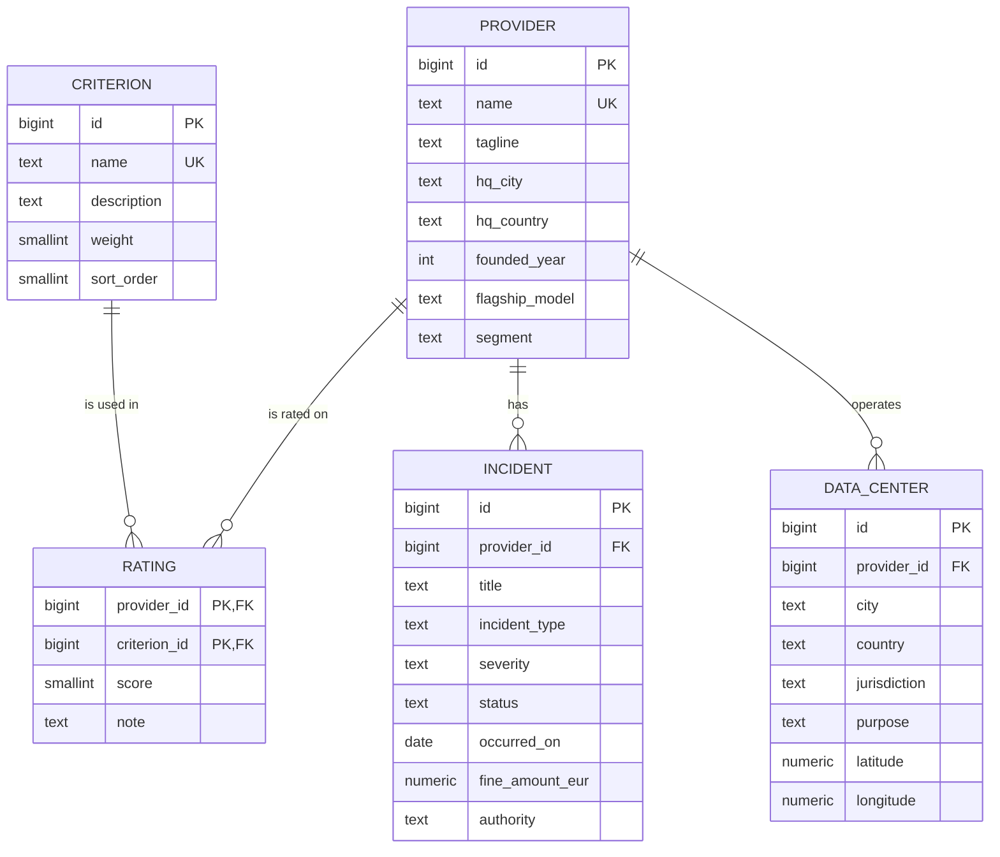

# ERD (Mermaid source)

Paste into https://mermaid.live to export a PNG/SVG for the slides.

```mermaid
erDiagram
    PROVIDER ||--o{ RATING : "is rated on"
    CRITERION ||--o{ RATING : "is used in"
    PROVIDER ||--o{ INCIDENT : "has"
    PROVIDER ||--o{ DATA_CENTER : "operates"

    PROVIDER {
        bigint id PK
        text name UK
        text tagline
        text hq_city
        text hq_country
        int founded_year
        text flagship_model
        text segment
    }
    CRITERION {
        bigint id PK
        text name UK
        text description
        smallint weight
        smallint sort_order
    }
    RATING {
        bigint provider_id PK,FK
        bigint criterion_id PK,FK
        smallint score
        text note
    }
    INCIDENT {
        bigint id PK
        bigint provider_id FK
        text title
        text incident_type
        text severity
        text status
        date occurred_on
        numeric fine_amount_eur
        text authority
    }
    DATA_CENTER {
        bigint id PK
        bigint provider_id FK
        text city
        text country
        text jurisdiction
        text purpose
        numeric latitude
        numeric longitude
    }
```

`ACTIVITY_LOG` is standalone (written only by database triggers).
